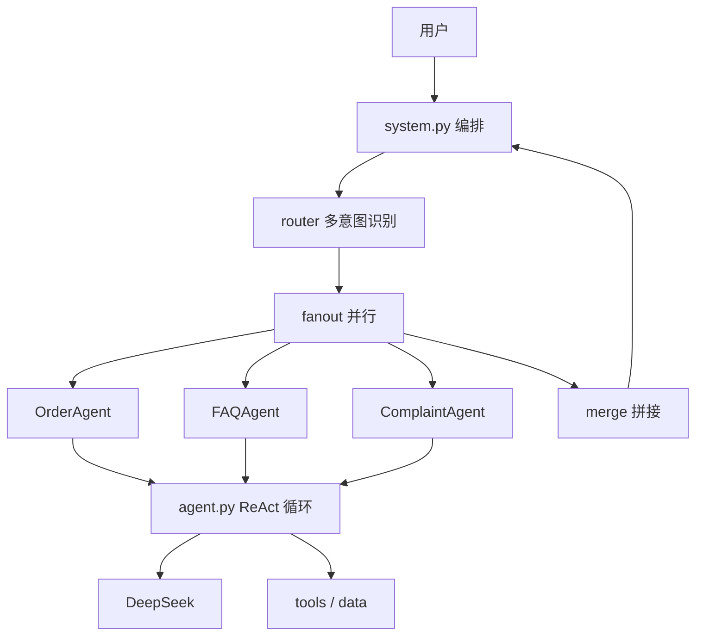

# customer-service

> 纯手写、**不依赖任何 Agent 框架**的 Multi-Agent 智能客服系统。

自己实现 ReAct / tool-calling 循环、工具注册、函数式 fan-out、多轮记忆——每个被 LangChain 等"藏起来"的底层机制都摊开写清楚，代码精良到能当博客逐篇读。

## 为什么不依赖框架

Agent 框架（LangChain / LangGraph / AutoGen）把"工具调用、消息循环、多 agent 编排"藏进黑盒。本项目反其道：**每个抽象都手写并讲透**。核心 `core/` 六个模块，每个 < 150 行，附 module docstring 说明"解决什么问题、为什么这么写"。

适合：想真正理解 Agent 原理、准备面试、写技术博客的人。

## 特性

- 🔧 **手写 function calling** — `@tool` 装饰器从类型注解 + docstring 反射生成 OpenAI schema，pydantic 校验参数
- 🧠 **ReAct 循环** — `max_steps` 硬上限 + 连续重复调用检测 + 工具错误回灌
- 🎯 **多意图路由** — 结构化分类 + 置信度阈值，支持"查订单 + 问政策"并行处理
- 🔀 **函数式 fan-out** — ThreadPoolExecutor 并行多 agent，明确**否决 actor 模型**（见 design-decisions）
- 📚 **手写 TF-IDF RAG** — 零依赖 FAQ 检索，不引入向量库
- 🧪 **零网络测试** — FakeLLM 队列式 mock；`ruff` + `mypy --strict` 全绿

## 架构



详见 [docs/architecture.md](docs/architecture.md)。

## 快速开始

```bash
uv sync
cp .env.example .env   # 填入 DEEPSEEK_API_KEY
uv run customer-service          # 交互式 REPL
uv run python -m customer_service.demo   # 预设 demo
```

完整步骤见 [docs/getting-started.md](docs/getting-started.md)。

## 文档

- [架构](docs/architecture.md) — 分层与数据流
- [设计决策](docs/design-decisions.md) — 7 个取舍的 why，含否决项与诚实声明
- [DeepSeek tool calling 探针](experiments/deepseek_tool_probe.md) — 实测 7/7 命中

## 项目结构

```
src/customer_service/
├── core/        # 纯手写精华（llm / message / tools / agent / router / fanout）
├── tools/       # 业务工具（order / faq / refund）
├── agents/      # 业务 Agent（core/agent 的薄封装）
├── data/        # orders.json / faq.json
├── system.py    # 编排入口：router → fanout → merge
├── cli.py       # 交互式 REPL
└── demo.py      # 预设演示
experiments/     # DeepSeek tool calling 探针
tests/           # FakeLLM + 全量单测（不触网）
```

## License

MIT
