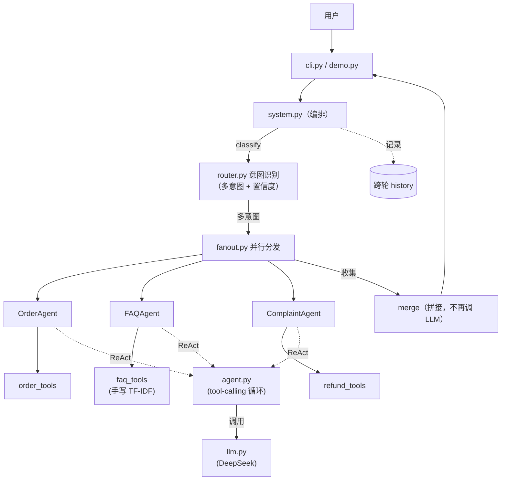

# 架构

## 总览

## 分层

| 层 | 模块 | 职责 |
|----|------|------|
| **core**（纯手写精华） | `llm.py` | LLM 客户端（sync）：超时 / 指数退避重试 / JSONL 日志 / provider 切换 |
| | `message.py` | `Message` / `Conversation` / 滑动窗口 truncate |
| | `tools.py` | `@tool` 装饰器：反射生成 OpenAI schema + pydantic 校验 |
| | `agent.py` | 单 Agent ReAct tool-calling 循环（max_steps / 重复检测 / 错误回灌） |
| | `router.py` | 结构化意图分类（多意图 + 置信度阈值） |
| | `fanout.py` | ThreadPoolExecutor 并行多 agent + merge |
| **业务** | `tools/` | order / faq / refund 工具 |
| | `agents/` | FAQ / Order / Complaint Agent（core/agent 的薄封装） |
| | `data/` | orders.json / faq.json |
| **入口** | `system.py` | 编排：router → fanout → merge + 跨轮记忆 |
| | `cli.py` / `demo.py` | 交互式 REPL / 预设演示 |

## 数据流

一次用户消息：

1. `system.chat()` → `router.classify()` 用 `response_format=json_object` 让 LLM 输出 `{intents: [{name, score}]}`，pydantic 校验 + 阈值过滤，得到 0~N 个意图。
2. 按意图选出对应 Agent，`fanout()` 并行（ThreadPool）调用各自的 `agent.run()`。
3. 每个 Agent 内部 ReAct 循环：LLM 决定调 tool → 执行 → 结果回灌 → 直到给出最终文本（或触达 `max_steps`）。
4. `merge()` 把多个 Agent 的回复拼接（**不再调 LLM**）。
5. system 把这一轮 user/assistant 写入 `history`，下一轮传给 Agent 让指代可解。

## 为什么这样分层

每个 `core` 模块解决一个被 Agent 框架"藏起来"的底层问题，且**独立可测**（配 `FakeLLM` 即可单测，不触网）。业务层只是 core 的薄封装 + 数据，几乎没有逻辑——所以加一个新客服领域通常只是加一个 `@tool` + 一个 `make_xxx_agent`。
